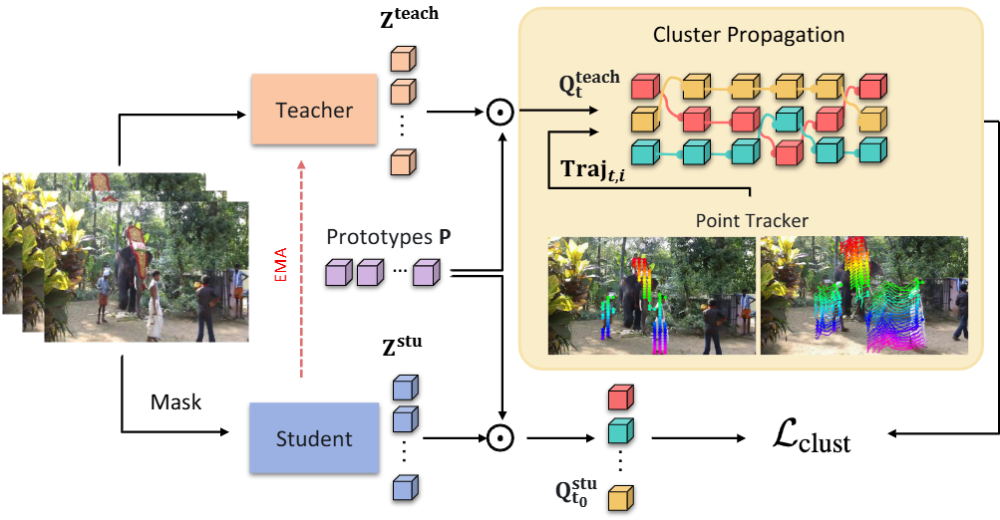
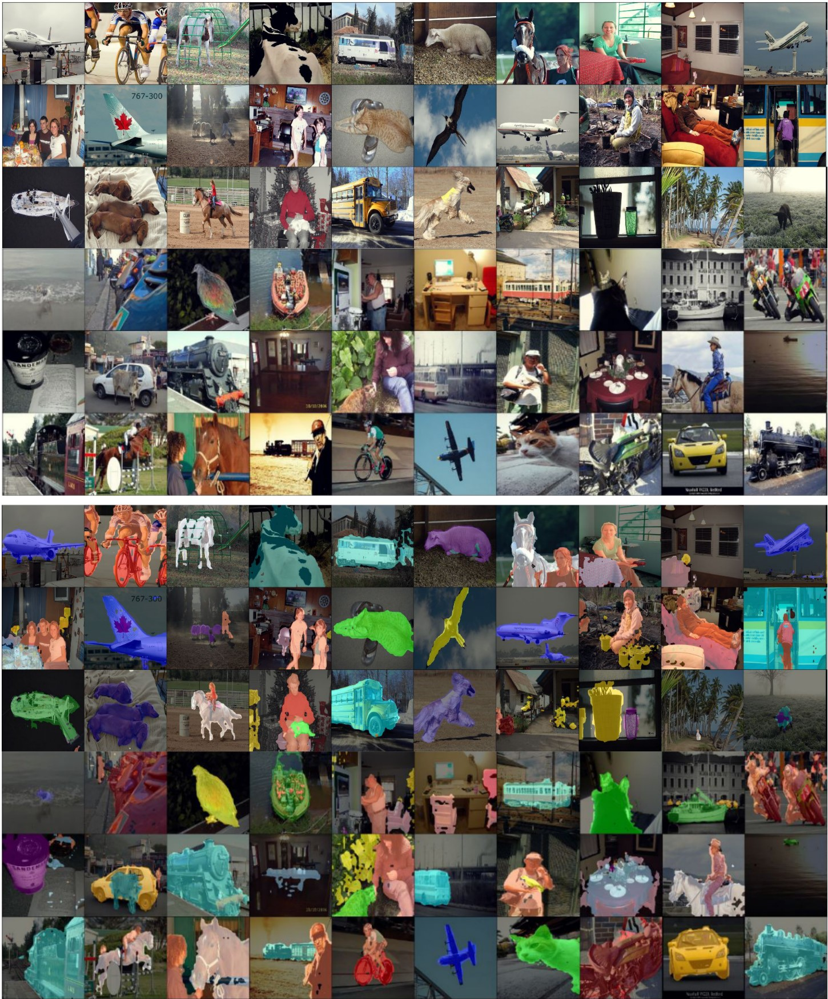

# MoSiC: Optimal-Transport Motion Trajectory for Dense Self-Supervised Learning

[Mohammadreza Salehi](https://scholar.google.com/citations?user=kpT3gcsAAAAJ&hl=en), [Shashanka Venkataramanan](https://scholar.google.co.in/citations?user=CbfH47IAAAAJ&hl=en), [Ioana Simion](https://scholar.google.com/citations?view_op=list_works&hl=en&hl=en&user=Su8iPecAAAAJ), [Efstratios Gavves](https://www.egavves.com/), [Cees G. M. Snoek](https://www.ceessnoek.info/), [Yuki M. Asano](https://yukimasano.github.io/),


## Table of Contents

- [Introduction](#introduction)
- [GPU Requirements](#gpu-requirements)
- [Environment Setup](#environment-setup)
- [Loading pretrained models](#loading-pretrained-models)
- [Training with MoSiC](#training-with-mosic)
- [Evaluation](#evaluation)
- [Dataset Preparation](#datasets)
- [Visualizations](#visualizations)
- [Citation](#citation)
- [License](#license)

## Introduction

MoSiC is a motion-guided self-supervised learning framework that learns dense visual representations from unlabeled videos. Motivated by the idea that "things that move together belong together", MoSiC tracks points across frames and clusters them using optimal transport to ensure features remain spatiotemporally consistent—even through occlusions and motion. By propagating cluster assignments along motion trajectories, it enforces object permanence and temporal coherence without requiring labels. Applied on top of strong image-pretrained models like DINOv2, MoSiC yields 1–6% gains across four dense prediction benchmarks, setting a new state-of-the-art on both video and image tasks.


<p align="center">
  
</p>


**Key features of MoSiC include:**

1. Enhancing dense features of pretrained vision models through video-based fine-tuning
2. Enforcing temporal semantic consistency via self-supervised clustering of motion trajectories in unlabeled videos
3. Improving representations across diverse backbones, including EVA-CLIP, DINO, and DINOv2(-R)
4. Requiring only 1.6 GPU-hours on YTVOS using 8×A6000 GPUs
5. Achieving state-of-the-art improvements (1–6%) across multiple image and video benchmarks


## GPU Requirements
MoSiC is optimized for efficient training. While our experiments use 8×A6000 GPUs to enable larger batch sizes and better performance, training on a single A6000 is also possible with smaller batches. Larger batch sizes were found to consistently improve performance.

## Environment Setup
We recommend using conda to install the dependencies for **MoSiC**. If you haven't installed conda yet, you can find the instructions [here](https://docs.conda.io/en/latest/miniconda.html).

The setup steps are:

**1 – Create a new environment from the provided YAML file:**

```bash
conda env create -f mosic_environment.yml
```

**2 – Activate the environment:**

```bash
conda activate MoSiC
```

## Loading pretrained models

We provide MoSiC checkpoints for multiple backbones: **DINO**, **DINOv2**, **EVA-CLIP**, and **DINOv2R**.  You can download the relevant checkpoint [here](https://drive.google.com/drive/folders/1bEfoe0WF0pL2elkWmFqWDPQwmMZ-f7sE?usp=sharing).

To use MoSiC embeddings for downstream dense prediction tasks, install `timm` and `torch`, then run the following (example shown for ViT-S/16):

```python
import torch
from timm.models.vision_transformer import vit_small_patch16_224

path_to_checkpoint = "<your path to downloaded MoSiC ckpt>"
model = vit_small_patch16_224()
state_dict = torch.load(path_to_checkpoint)

# Adjust key names if needed
model.load_state_dict({'.'.join(k.split('.')[2:]): v for k, v in state_dict.items()}, strict=False)

# Extract semantically rich patch embeddings (e.g., 16x16 patches)
features = model.forward_features(batch)
```

⚠️ Make sure to match the model architecture (e.g., vit_base_patch14_224 or vit_large_patch14_clip_224) with the backbone used in the checkpoint. Using a mismatched architecture will result in incorrect or failed weight loading.


## Training with MoSiC

To train MoSiC, simply run:

```bash
./train.sh
```

### Training Parameters Explained

The training script uses the following key parameters:

- `--batch_size 64`: Number of samples processed per GPU
- `--frame_sampling_mode regular`: Uses regular interval sampling for video frames
- `--regular_step 6`: Samples every 6th frame from the video
- `--num_clip_frames 12`: Number of frames to process in each video clip
- `--num_clips 1`: Number of clips to sample from each video
- `--num_epochs 8`: Total number of training epochs
- `--num_prototypes 100`: Number of clusters for the optimal transport clustering
- `--feature_upsampling nearest`: Uses nearest neighbor upsampling for features
- `--num_workers 8`: Number of data loading workers per GPU
- `--model_type dinov2-s`: Uses DINOv2-small as the backbone model
- `--dataset ytvos`: Trains on the YouTube-VOS dataset
- `--mask_ratio 0`: No masking applied to the input
- `--grid_size 16`: Size of the feature grid (16x16 patches)
- `--crop_scale 0.4`: Random crop scale for data augmentation
- `--wandb_mode online`: Enables online logging to Weights & Biases
- `--use_EMA_teacher True`: Uses Exponential Moving Average for the teacher model
- `--teacher_feature_upsampling nearest`: Uses nearest neighbor upsampling for teacher features
- `--save_dir`: Directory to save the trained model checkpoints

The script is configured to use 8 GPUs by default. For single GPU training, modify the `CUDA_VISIBLE_DEVICES` and `--nproc_per_node` parameters accordingly.

## Evaluation
### Standard Evaluation Tasks
For standard evaluation tasks including linear evaluation, overclustering, and unsupervised object segmentation, you can use our provided checkpoint with the evaluation scripts from the [NeCo repository](https://github.com/vpariza/NeCo). Simply download our checkpoint, load it into their evaluation framework, and run their standard evaluation protocols to reproduce our reported results.

### Visual In-Context Learning
For visual in-context learning evaluation, we use a modified version of [open-hummingbird-eval](https://github.com/vpariza/open-hummingbird-eval) that we adapted for multi-GPU evaluation. The `hummingbird_eval.sh` script supports the following key parameters:

- `--model`: Model type (e.g., mosic_dinov2-l)
- `--input-size`: Input image size (default: 518)
- `--batch-size`: Batch size per GPU (default: 24)
- `--embeddings-size`: Size of embeddings (default: 1024)
- `--patch-size`: Size of image patches (default: 14)
- `--memory-size`: Memory size for processing (default: 10240000)
- `--num-workers`: Number of data loading workers (default: 2)
- `--dataset`: Dataset name (e.g., ade20k)
- `--data-dir`: Path to dataset directory
- `--train-split`: Training split file name

The script is configured to use 3 GPUs by default (`--nproc_per_node=3`). You can modify the number of GPUs and other parameters as needed for your setup. For evaluating on dataset fractions, the train-splits can be downloaded from [this Google Drive folder](https://drive.google.com/drive/folders/1AFhK1ZBKRZ0t-0Z6piMRuDxUhWtKfdbl?usp=sharing).

Example usage:
```bash
./hummingbird_eval.sh
```

The evaluation results will be saved in the `hb/` directory with the naming format `hummingbird_MoSiC_dinov2-l_ade20k{split_name}.log`.

## Datasets
Our model uses the same dataset structure as described in the [Timetuning dataset documentation](https://github.com/SMSD75/Timetuning/blob/main/dataset_README.md). Please follow the guidelines there to properly format your datasets for use with our model.


## Visualizations
### Visual in-context scene understanding



The figure shows MoSiC's in-context scene understanding capabilities on Pascal VOC. By training DINOv2's dense representations on unlabeled videos, MoSiC achieves precise segmentation boundaries and object identification.

<!--
## Citation
If you find this work useful in your research, please consider citing:

```bibtex
@article{mosic2024,
  title={MoSiC: Optimal-Transport Motion Trajectory for Dense Self-Supervised Learning},
  author={Author1 and Author2 and Author3},
  journal={arXiv preprint},
  year={2024}
}
```
-->

<!-- ## License
This project is licensed under the MIT License - see the [LICENSE](LICENSE) file for details.

## Acknowledgments
We thank all contributors and the research community for their valuable feedback and support. -->
